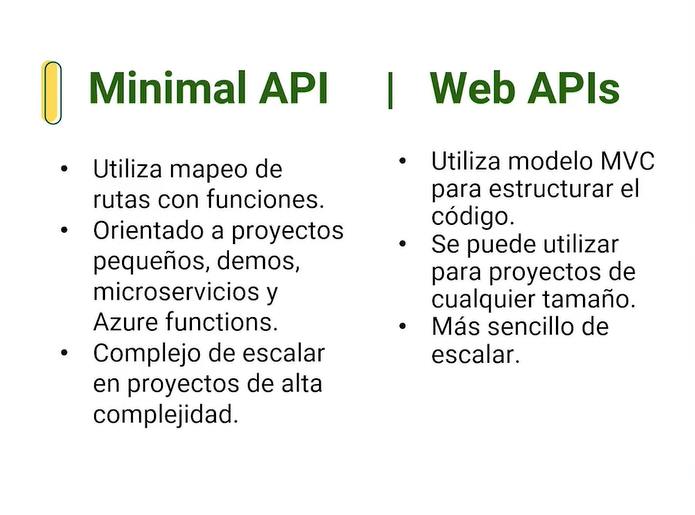
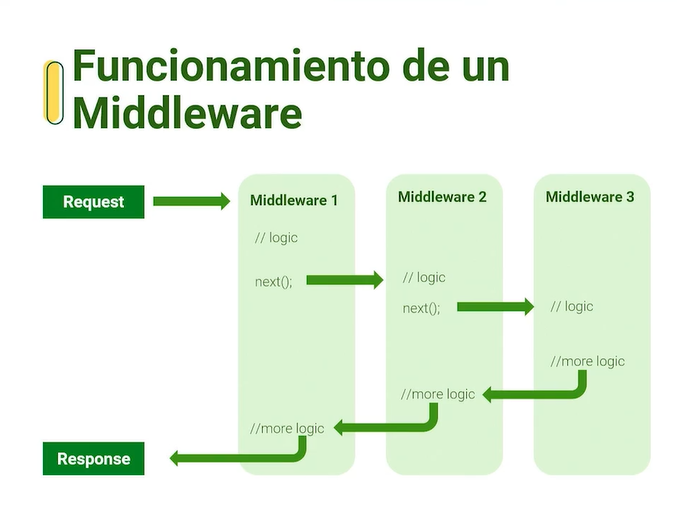
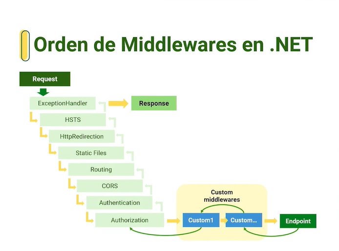

## Controler - Logica
Se encarga de manejar toda la logica para poder devolver los datos y exponerlos

## Minimal API vs Web API
 Minimal Api
 * Nueva Plantilla con nun estilo minimalista
 * Utiliza las últimas mejoras de C# y .NET para disminuir las lineas de código.
 * Facilita la curva de aprendizaje de APIs en .NET 

 ```
 dotnet new web
 ```



## Middlewares

Es la base que nos permite que la API se ejecute  y procese cada uno de los request tambia se utiliza para temas de seguridad y autorizacion y con todos los filtros. 

* Serie de instrucciones de código que se agrena al ciclo de vida de una peticion HTTp
* provee una jecucion de peticiones a travez de capas
* Facilitan la implementación de interceptores y filtros sobre las peticiones en una API.



