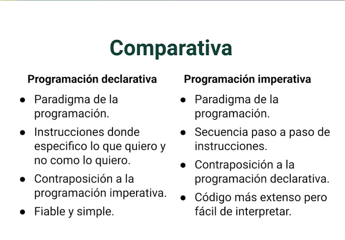
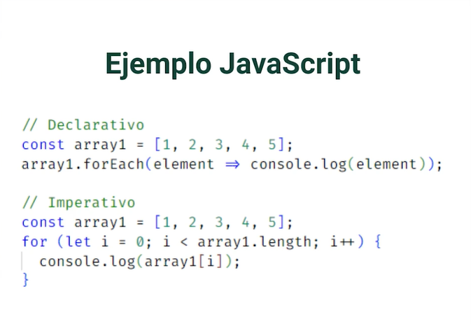

# Manejo de Datos en C# con LINQ


**LINQ** Es un conjunto de tecnologías en .NET que viene del término (Language Integrated Query) que sirve para consultar datos desde diferentes fuentes de datos

**Ejemplo de Uso**
```
    //linq como expresion 
    var unTomate = from t i ArraydeStrings
                        where t == "Tomate"
                                select t;

    // Link con metodos de extencion
    ArraydeStrinfs.Where(t=> t =="Tomate")
```





